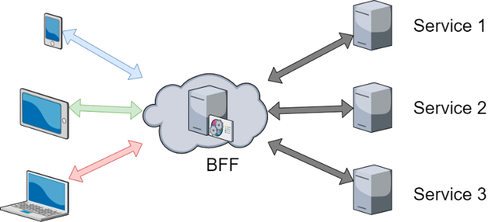

# Backend for Frontend

## What is BFF?
The **BFF pattern** (Backend for Frontend) is an architectural software pattern that improves how data is fetched between clients (a browser, a mobile app or any device connected to the Internet) and servers (any machine hosted on the cloud or anywhere else).



We use [API routes next.js](https://nextjs.org/docs/api-routes/introduction) feature for the BFF where we collect information from microservices and 3rd party services with REST APIs.

All endpoint documentation you can find in `/api-doc` environment route (in localhost http://localhost:3000/api-doc). The API documentation is prepared by swagger.

## How to work with BFF?

All BFF functionality you can find in `pages/api` folder. if you need new endpoint you should:
1. Create new ts file inside `pages/api` with correct namespace.
2. Add shared types in `types` folder.
3. Use `apiRouteHandler` helper for common functionality and validation.
4. Add swagger annotation.

`apiRouteHandler` - is one of the function that take care about checking that user define correct request method and authentication with error handling.

```ts
export default apiRouteHandler({
  post: async (req: NextApiRequest, res: NextApiResponse<undefined | ErrorMessage>) => {
      // post request code here
  },
  get: (req: NextApiRequest, res: NextApiResponse<undefined | ErrorMessage>) => {
      // get request code here
  }
});
```

## Data handling
If you need data from body or query of the request you can use `class-transformer` lib. With this lib you create and class with fields. 
```ts
import { plainToInstance } from 'class-transformer';

type SignupRequest = {
  email: string;
  password: string;
  firstName?: string;
  lastName?: string;
};

class SignupRequest implements SignupRequest {
  email: string = '';
  password: string = '';
  firstName?: string;
  lastName?: string;
}

export default apiRouteHandler({
  post: async (req: NextApiRequest, res: NextApiResponse<undefined | ErrorMessage>) => {
    const data = plainToInstance(SignupRequest, req.body);
    
    // process the data

    res.status(200).end();
  },
});
```

## Router with required auth
`apiWithAuth` function can be use for the api routes where user or session token is required. 

Example
```ts
export default apiRouteHandler({
  post: apiWithAuth(async (req: NextApiRequest, res: NextApiResponse<undefined | ErrorMessage>, { user, sessionToken }) => {
    const data = plainToInstance(SignupRequest, req.body);
    
    // process the data

    res.status(200).end();
  }),
});
```

If user unauthorized response will be 401

## Communication with microservices

For communication between microservices we prebuild libs from microservices opengraph schema (you can find it in `api/lib` folder). All these services is autogenerated and shouldn't be modified manually. How to generate these libs you can find in main README.md file.  

Example of the using core service.
```ts
import { authenticationApi } from '@api/lib/core';

await authenticationApi.signup({
  email: data.email,
  password: data.password,
  firstName: data.firstName,
  lastName: data.lastName,
  languageId: 'en',
  siteId: getSiteId(),
  countryId: 'RU',
});
```
