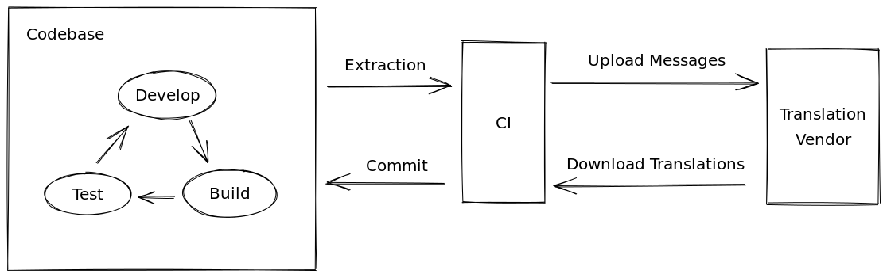

# Internationalisation

For Internationalisation on the FE side, we use [react-intl (format.js)](https://formatjs.io/) as a semi-native solution
for browser/node.js.

How react-intl working with applications: https://formatjs.io/docs/getting-started/application-workflow/

## Why format.js?

FormatJS is a set of JavaScript libraries
FormatJS is a modular collection of JavaScript libraries for internationalization that are focused on formatting
numbers, dates, and strings for displaying to people. It includes a set of core libraries that build on the JavaScript
Intl built-ins and industry-wide i18n standards, plus a set of integrations for common template and component libraries.

### Built-in CLI tool

With FormatJS we can use [format.js cli](https://formatjs.io/docs/tooling/cli/) that helps you extract transaltions from
a list of files and manage them. This is very helpful if you want to integrate 3rd party localization service.

### Support pseudo-locale

Pseudo-locale is technic that helps find untranslated strings in your application.
Link: https://formatjs.io/docs/tooling/cli/#--pseudo-locale-pseudolocale

### Support plenty of build type

This is important if you want to integrate 3rd party localization service. Because every localization service can have
its own format (format can be not simple JSON, but have different plural schema + comments for the translations and file
when we can find this translation)

Documentation: https://formatjs.io/docs/tooling/cli/#builtin-formatters

### Realtime change locales

FormatJS supports real-time locales changing.

### Formatting complex string with react

FormatJS supports JSX as value in strings (it’s named chunks).

```tsx
<FormattedMessage
  id="foo"
  defaultMessage="To buy a shoe, <a>visit our website</a> and <cta>buy a shoe</cta>"
  values={{
    a: chunks => (
      <a
        class="external_link"
        target="_blank"
        href="https://www.example.com/shoe"
      >
        {chunks}
      </a>
    ),
    cta: chunks => <strong class="important">{chunks}</strong>,
  }}
>
  {chunks => <h2>{chunks}</h2>}
</FormattedMessage>
```

## Localization Workflow

### Pipeline

A generic translation pipeline looks something like this:



1. **Extraction**: This step aggregates all defaultMessage from your application into a single JSON file along with
   description, ready to be translated.
2. **Upload Messages**: This step uploads the JSON file to your translation vendor.
3. **Download Translations**: This step either polls your translation vendor or hooks into your vendor to download
   translated transaltions in the set of locales that you configured.
4. **Commit**: This commits back translation transaltions to the codebase.

## Next.js and internatialisation

By default, with next.js we use built-int next.js internationalization. As a locale strategy, we use Sub-path Routing.
Every route should have information about locale or by default using English.

### react-intl integration

We integrate react-intl in `_app.tsx` for all routes with the provider and use short locale because react-intl, for now,
supports only short language code.

## How to work with react-intl

### Add new string

For adding a new string we use `defaultMessage` prop from the `FormatMessages`. We will use these `defaultMessages` in
the extraction phase and prepare files for the translations.

```jsx
// Avoid using this variant. It's just for example. Use defaultMEssages instead
<FormattedMessage
  id="app.greeting"
  description="Greeting to welcome the user to the app"
  defaultMessage="Hello, {name}!"
  values={{
    name: 'Eric',
  }}
/>
```

We preferred to use `Message Descriptor` in react-intl because in the future we can extract from this line author of
this translation.

```jsx
const transaltions = defineMessages({
  greeting: {
    id: 'app.greeting',
    defaultMessage: 'Hello, {name}!',
    description: 'Greeting to welcome the user to the app',
  },
})

const Component = () =>
  <FormattedMessage
    {...transaltions.greeting}
    values={{
      name: 'Eric',
    }}
  />
```

### Using JSX/HTML inside translation

Translation string should always have only text and translation placeholders. For this reason, in react-intl, we can use
chunks to include custom HTML/JSX.

```jsx
const transaltions = defineMessages({
  greeting: {
    id: 'app.greeting',
    defaultMessage: 'Hello, <b>Eric</b> {icon}',
    description: 'Greeting to welcome the user to the app',
  },
})
```

```jsx
<FormattedMessage
  {...messages.greeting}
  values={{
    b: chunks => <b>{chunks}</b>,
    icon: <svg/>,
  }}
/>
```

Documentation: https://formatjs.io/docs/react-intl/components/#rich-text-formatting

### IMPORTANT for next.js

Inside <Head> component we can use only useIntl because Head rendered outside IntlProvider and if you try to use
FormattedMessages you always get an error.

Issue:
https://github.com/vercel/next.js/issues/1636

### Components over functions

Beyond providing an idiomatic-React way of integrating internationalization into a React app, and the <Formatted*>
components have benefits over always using the imperative API directly:

Render React elements that seamlessly compose with other React components.

Support rich-text string/message formatting in <FormattedMessage>.

Implement advanced features like <FormattedRelativeTime>'s updating over time.

Provide TypeScript type definitions.
